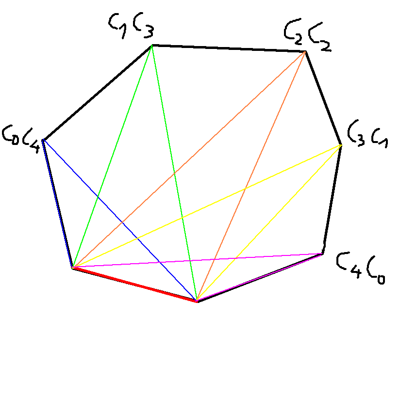

- $a_n$ - liczba możliwości podziału wielokąta wypukłego o $n + 1$ bokach na trójkąty przez wybranie $n - 2$ nieprzecinających się przekątnych

Chcemy pokazać

$$
    a_n = a_1a_{n-1} + a_2a_{n-2} + \dots + a_{n - 1}a_1
$$

Rozważmy wybrany bok wielokąta. Oczywiście jest on też jednym z boków trójkąta po podziale. Zauważmy, że ten trójkąt jest jednoznacznie wyznaczany przez wybór jednego z $n - 1$ wierzchołków (oprócz dwóch na końcach boku). Podział ten dzieli również wielokąt na trójkąt oraz dwie figury po obu stronach trójkąta, o odpowiednio $i$ i $n + 1 - i$ wierzchołkach. W szczególności może zajść $i = 2$. Dla wybranego trójkąta liczba możliwych podziałów dużego wielokąta to iloczyn możliwych liczb podziałów dwóch mniejszych. Oznaczmy je (zupełnie przypadkowo) $C_{i - 2}$ i $C_{n - i - 1}$. 

Wtedy oczywiście 

$$
    a_n  = C_0C_{n-2} + C_1C_{n-3} + \dots + C_{n-2}C_{0} = \sum\limits_{i=0}^{n-2}C_{i}C_{n - i - 2} = C_{n-1}
$$

Ale zaraz zaraz... To przecież liczby Catalana! Liczba drzew binarnych, Dyck words, te sprawy. Ok, weźmy się za funkcję tworzącą. 

$$
\begin{align*}
    C(x) &= \sum\limits_{n = 0}^{\infty} C_n x^n\\
     &= 1 + \sum\limits_{n = 1}^{\infty} C_n x^n\\
     &= 1 + \sum\limits_{n = 0}^{\infty} C_{n + 1} x^{n + 1}\\
     &= 1 + x\sum\limits_{n = 0}^{\infty} C_{n + 1} x^{n}\\
     &= 1 + x\sum\limits_{n = 0}^{\infty} (\sum\limits_{i=0}^{n}C_{i}C_{n - i}) x^{n} \\
     &= \text{Cauchy Product} \\
     &= 1 + x(\sum\limits_{j=0}^{\infty}C_{j}x^j)(\sum\limits_{m=0}^{\infty}C_{m}x^m)\\
     &= 1 + xC(x)^2
\end{align*}
$$

Dostaliśmy więc równanie kwadratowe.

$$
\begin{align*}
    C(x) &= 1 + xC(x)^2\\
\end{align*}
$$

Aby oszczędzać papier, pominiemy proste rachunki i powiemy, że rozwiązania równania to $\frac{1+\sqrt{1-4x}}{2x}$ i $\frac{1-\sqrt{1-4x}}{2x}$. Wiemy, że $C(0) = C_0 = 1$.

$$
    \lim_{x \rightarrow 0^+} \frac{1+\sqrt{1-4x}}{2x} = \infty
$$

$$
    \lim_{x \rightarrow 0} \frac{1-\sqrt{1-4x}}{2x} = \lim_{x \rightarrow 0} \frac{4x}{2x(1+\sqrt{1-4x})} = 1
$$

Więc weźmiemy ten drugi wynik.

Teraz interesuje nas wzór na $a_n$. To już w zasadzie pokazaliśmy. Wiemy, że $a_n = C_{n - 1}$ Pamiętamy też wzór

$$
    C_n = \frac{1}{n+1} \binom{2n}{2}
$$

stąd 

$$
    a_n = \frac{1}{n} \binom{2n - 2}{2}
$$

Oczywiście możemy się pobawić i np. zbudować bijekcję między wielokątami a Dyck word - a nich już ładnie widać wzór. Polecam: <https://youtu.be/fczN0BCx0xs?si=bxC_orB5hxYQrT2T>. Dla spokoju ducha przedstawimy też bardziej formalne wyprowadzenie (choć niechętnie)

$$
\begin{align*}
    C(x) &= \frac{1-\sqrt{1-4x}}{2x}\\
         &= \frac{1}{2x}(1-\sqrt{1-4x})\\
         &= \frac{1}{2x}(1-(1-4x)^{\frac{1}{2}})\\
         &= \frac{1}{2x}\left(1-\sum\limits_{n = 0}^{\infty}\binom{\frac{1}{2}}{n}(-4x)^n\right)\\
        &= \frac{1}{2x}\left(1-\sum\limits_{n = 0}^{\infty}\frac{(-1)^{n+1}}{4^n (2n- 1)}\binom{2}{n}(-1)^n4^n x^n\right)\\
        &= \frac{1}{2x}\left(1+\sum\limits_{n = 0}^{\infty}\frac{1}{(2n- 1)}\binom{2}{n} x^n\right)\\
        &= \frac{1}{2x}\left(\sum\limits_{n = 1}^{\infty}\frac{1}{(2n- 1)}\binom{2}{n} x^n\right)\\
        &= \frac{1}{2x}\sum\limits_{n = 0}^{\infty} \frac{1}{(2n + 1)}\binom{2n + 2}{n+1}x^{n+1}\\
        &= \sum\limits_{n = 0}^{\infty} \frac{1}{2(2n + 1)}\binom{2n + 2}{n+1}x^n\\
        &= \sum\limits_{n = 0}^{\infty} \frac{1}{n + 1}\binom{2n}{n}x^n\\
        &= \sum\limits_{n = 0}^{\infty} C_n x^n\\
\end{align*}
$$
